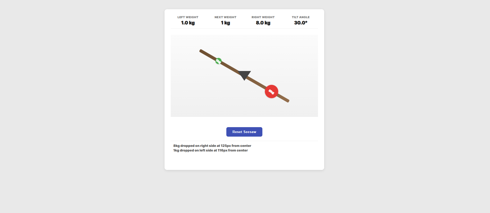

# Seesaw Simulation

A physics-based interactive seesaw simulation built with pure vanilla JavaScript. Users can click on the plank to drop objects with random weights, and watch the seesaw tilt based on real-time torque calculations.

## 🎮 Live Demo

**[View Live Demo](https://kerimcanyektek.github.io/seesaw-simulation)**

## 📸 Preview


*Interactive seesaw with real-time physics and visual feedback*

## ✨ Features

- **Real-time Physics Simulation**: Accurate torque calculations (`weight × distance from pivot`)
- **Interactive Click System**: Drop objects by clicking directly on the plank
- **Visual Preview System**: See the next weight before dropping
- **State Persistence**: LocalStorage integration to save progress across sessions
- **Smooth Animations**: CSS-based transitions for natural tilting motion
- **Color-Coded Weights**: Visual feedback system (Green: 1-3kg, Orange: 4-6kg, Red: 7-10kg)
- **Live Statistics**: Real-time display of left/right weights and tilt angle
- **Developer Log**: Built-in logging system for debugging and tracking
- **Responsive Design**: Fully functional on desktop and mobile devices
- **Reset Functionality**: Clear button to restart the simulation

## 🎯 Core Requirements

This project was developed as a hiring case study with the following specifications:

✅ Pure JavaScript, HTML, and CSS (no frameworks or libraries)  
✅ Click interactions limited to the seesaw plank only  
✅ Random weight generation (1-10 kg)  
✅ Torque-based physics: `torque = weight × distance`  
✅ Tilt angle capped at ±30 degrees  
✅ Smooth tilt animations  
✅ LocalStorage for state persistence  
✅ Visual display of total weights on each side  

## 🔧 Implementation Details

### Physics Logic

The seesaw uses classical mechanics torque calculation:
```javascript
torque = weight × distance_from_pivot
tilt_angle = (rightTorque - leftTorque) / 10
// Capped between -30° and +30°
```

**Key Points:**
- Pivot is positioned at the exact center of the plank (200px from each end)
- Objects on the left side create negative torque
- Objects on the right side create positive torque
- The angle divisor (÷10) provides smooth, realistic tilting motion

### Design Decisions

**1. Click Area Restriction**
- Initially implemented click detection on the entire simulation area
- Refined to restrict clicks to the plank element only for better UX
- Used `e.stopPropagation()` to prevent event bubbling

**2. Preview Ball System**
- Shows the upcoming weight before clicking
- Follows mouse cursor only when hovering over the plank
- Provides strategic planning opportunity for users
- Implements smooth opacity transitions for better visual feedback

**3. LocalStorage Strategy**
- Saves object positions as **relative values** (0 to 1) instead of absolute pixels
- Ensures state persistence works correctly across different screen sizes
- Stores upcoming weight to maintain continuity

**4. Color Coding System**
```javascript
weight 1-3kg  → Green  (#4caf50) - Light objects
weight 4-6kg  → Orange (#ff9800) - Medium objects
weight 7-10kg → Red    (#e53935) - Heavy objects
```

**5. Animation Approach**
- Used CSS transitions for smooth tilting (`0.45s cubic-bezier`)
- Implemented drop animation with `@keyframes` for visual polish
- Prioritized GPU-accelerated `transform` properties for performance

### Trade-offs & Limitations

**Conscious Decisions:**
- **Simple Object Shapes**: Used circles instead of complex shapes for clarity and performance
- **No Collision Detection**: Objects can overlap - prioritized physics accuracy over visual realism
- **30° Maximum Tilt**: Prevents extreme angles that would make the simulation hard to use
- **Single Page Application**: No routing needed for this focused use case
- **Fixed Plank Length**: 400px on desktop, 300px on mobile for optimal experience

**Technical Constraints:**
- Objects are positioned absolutely within the plank container
- Rotation happens around the center point using `transform-origin`
- Mobile screens receive a scaled-down version of the simulation

### Challenges Faced

**1. Click Event Propagation**
Initially, click events were registered on the entire simulation area, which didn't match the requirement. Fixed by:
- Moving event listener from `simulationArea` to `plank`
- Adding `e.stopPropagation()` to prevent bubbling
- Adjusting coordinate calculations to use plank's bounding rect

**2. Smooth Animation Timing**
Finding the right balance between responsive feedback and smooth motion required iteration:
- Tested various CSS transition durations (0.3s, 0.45s, 0.6s)
- Settled on `0.45s` with `cubic-bezier(.23,.84,.41,1)` for natural physics feel

**3. LocalStorage Responsiveness**
Storing absolute pixel positions caused issues on different screen sizes:
- Solution: Store relative positions (0-1 range)
- Recalculate absolute positions on load based on current plank width

**4. Preview Ball Behavior**
Ensuring the preview ball only appears over the plank required careful event handling:
- Used `mouseenter`/`mouseleave` for opacity control
- Positioned relative to simulation area but visibility tied to plank hover

## 🤖 AI Usage Disclosure

During the project, I personally enjoyed building this simulation. I have experience with JavaScript challenges from platforms like LeetCode and similar sites, but this physics-based project was particularly enjoyable.

**My Development Process:**
- **HTML & CSS**: Completely written by me without AI assistance
- **Core JavaScript Logic**: Implemented manually including event handling, DOM manipulation, physics calculations, and state management

**AI Tool Usage (Claude AI):**
I used Claude AI primarily for **code review and debugging** purposes:
- Identified the click event propagation issue (clicks working outside the plank)
- Reviewed physics calculation logic for accuracy
- Suggested improvements for the preview ball interaction behavior

**What AI Did NOT Do:**
- Did not generate the main codebase
- Did not write the physics simulation logic
- Did not create the UI structure or styling
- Did not implement the state management system

I can clearly explain every part of the implementation and all design decisions made throughout the development process.

## 🛠️ Technologies Used

- **JavaScript (ES6+)**: Core logic and DOM manipulation
- **HTML5**: Semantic structure
- **CSS3**: Styling, animations, and responsive design
  - Flexbox & Grid for layout
  - CSS transforms for rotation
  - Keyframe animations for effects
  - Media queries for responsiveness

## 📂 Project Structure
```
seesaw-simulation/
├── assets/
│   └── seesaw.png      # Project screenshot
├── index.html          # Main HTML structure
├── style.css           # Styling and animations
├── app.js              # Core JavaScript logic
└── README.md           # This file
```

## 🚀 Local Development
```bash
# Clone the repository
git clone https://github.com/kerimcanyektek/seesaw-simulation.git

# Navigate to project directory
cd seesaw-simulation

# Open in browser
# Simply open index.html in your preferred browser
# No build process or dependencies required
```

## 🎓 Learning Outcomes

This project demonstrates proficiency in:
- Pure JavaScript DOM manipulation
- Physics simulation and mathematical calculations
- Event handling and propagation
- LocalStorage API usage
- CSS animations and transforms
- Responsive web design
- Git workflow and version control
- Code organization and structure

## 👨‍💻 Author

**Kerimcan Yektek**

- GitHub: [@kerimcanyektek](https://github.com/kerimcanyektek)

## 📄 License

This project was created as part of a hiring case study.

---
